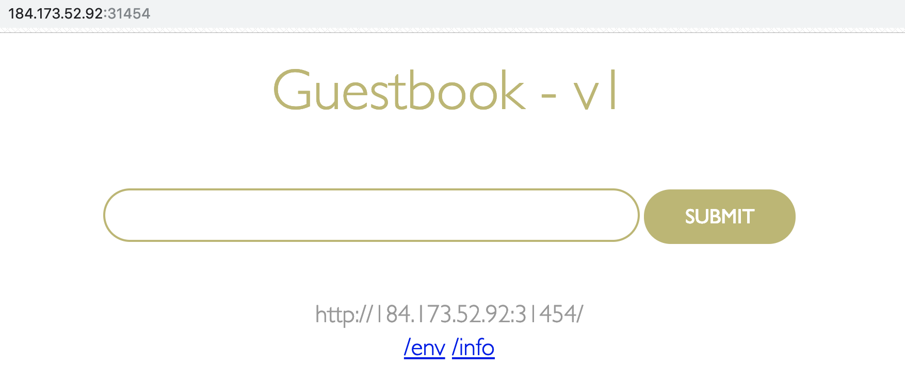

# Lab 1) Kubernetesクラスターへのアプリケーションデプロイ
Kubernetesクラスターへのアプリケーションのデプロイ方法を学びます。

Lab1〜3ではWebサイトのゲストブック機能を提供するシンプルなWebアプリケーション(guestbook)を使用します。

## 1. K8sクラスターへのアプリケーションデプロイ
`guestbook` アプリケーションをK8sクラスターにデプロイします。  
使用するアプリは`ibmcom/guestbook:v1` という名前で，ビルド済のDockerイメージがDockerHub上にアップロード済です。

1. `guestbook`を実行します。

   実行例:

   ```bash
   $ kubectl run guestbook --image=ibmcom/guestbook:v1
   kubectl run --generator=deployment/apps.v1beta1 is DEPRECATED and will be removed in a future version. Use kubectl create instead.
   deployment.apps/guestbook created
   ```
   
   >補足:  
   > アプリケーションの実行ステータスを確認してみましょう。
   > 
   > ```bash
   > $ kubectl get pods
   > NAME                         READY   STATUS    RESTARTS   AGE
   > guestbook-75786d799f-8c8cv   1/1     Running   0          1m
   > ```
   > 
   > コマンド実行直後は，STATUS属性が `ContainerCreating` です。少し待つと実行中を示す`Running`に変わります。READY属性も `0/1`から`1/1`に変わっているはずです。
   >    
   > runコマンドの実行によって`guestbook`コンテナが内包されている`Pod`が生成されました。ですが生成されたものは，`Pod`だけではなく， K8sでコンテナを上手く管理するための以下のコンポーネントが生成されています。
   > 
   > - **Pod**: アプリケーションコンテナを内包するK8sリソース
   > - **ReplicaSet**: Podのライフサイクル管理をするK8sリソース
   > - **Deployment**: Pod/ReplicaSetのライフサイクルを管理するK8sリソース
   >  
   > 上記のK8sリソースを確認するために以下コマンドを実行します。 (guestbookに関連するPod/ReplicaSet/Deploymentが確認できます)
   > 
   > ```bash
   > $ kubectl get all
   > NAME                             READY   STATUS    RESTARTS   AGE
   > pod/guestbook-75786d799f-8c8cv   1/1     Running   0          7m
   > 
   > NAME                 TYPE        CLUSTER-IP   EXTERNAL-IP   PORT(S)   AGE
   > service/kubernetes   ClusterIP   172.21.0.1   <none>        443/TCP   14h
   > 
   > NAME                        DESIRED   CURRENT   UP-TO-DATE   AVAILABLE   AGE
   > deployment.apps/guestbook   1         1         1            1           7m
   > 
   > NAME                                   DESIRED   CURRENT   READY   AGE
   > replicaset.apps/guestbook-75786d799f   1         1         1       7m
   > ```
   
2. Podのステータスが「実行中(Running)」になったら，K8sクラスターの外からも`guestbook`にアクセスできるようアプリを外部公開します。

   ワーカーノードのIPを介して外部からアクセスできるようにするために， **Deployment**を**Service**を使用して公開します。

   以下の手順で `guestbook` アプリケーションが3000番ポートでLISTENするようにします。
   
   実行例:

   ```bash
   $ kubectl expose deployment guestbook --type="NodePort" --port=3000
   service/guestbook exposed
   ```
   
   >補足:
   > - **Service**: K8sリソースの一つです。K8sクラスター内のPod間通信を制御したり，外部からのリクエストを適切なPodにルーティングさせるなどの役割を担います。`Service`の種類には、`NodePort`，`LoadBalancer`，`Ingress`などがあります。
   > 
   > 今回はK8sクラスターの単一のワーカーノードのIPアドレスを宛先として外部公開する方法を定義しています。(`--type=NodePort`)
   
3. ワーカー・ノードで`guestbook`アプリを公開しているポート番号を調べるために，Service情報を取得します。
   
   実行例:

   ```bash
   $ kubectl get service guestbook
   NAME        TYPE       CLUSTER-IP      EXTERNAL-IP   PORT(S)          AGE
   guestbook   NodePort   172.21.90.114   <none>        3000:31454/TCP   17s
   ```
   
   上記の例では，`<NodePort>` の値は `31454` です。
   
   >補足:  
   > `3000:31454`の表記は，Podが31454ポートで外部公開され，内部的に3000ポートにフォワードされることを表しています。
   > 外部公開するポート番号は任意に指定することも可能です。指定がない場合、IKSでは30000 〜 32767番のポートが自動的に割り当てられます。

4. 現在 `guestbook` アプリケーションは，ご自身のK8sクラスター上で動作しており，インターネットに公開されている状態です。
   アクセスするために，ワーカーノードのパブリックIPアドレス(`Public IP`)を取得します。
   
   実行例:

   ```bash
   $ ibmcloud ks workers mycluster
   OK
   ID                                                 Public IP       Private IP      Machine Type   State    Status   Zone    Version
   kube-hou02-pa705552a5a95d4bf3988c678b438ea9ec-w1   184.173.52.92   10.76.217.175   free           normal   Ready    hou02   1.10.12_1543
   ```
   
   上記の例では，`<Public IP>` の値は `184.173.52.92` です。
   
5. 3.および4.の手順で取得した，IPアドレス(`Public IP`)とポート番号(`NodePort`)を使用してアプリケーションにアクセスします。

   ブラウザ上で， `<Public IP>:<NodePort>` のように指定します。今回の例では， `184.173.52.92:31454` です。  
   以下のような画面が表示されていればOKです。
   
   
   
以上でサンプルアプリケーション`guestbook`をK8sクラスター上にデプロイし，外部からアクセス可能な状態にできました。

最後に， **Lab1で作成したK8sリソースを以下のコマンドで削除** します。

  ```bash
  1) Deploymentを削除する
  $ kubectl delete deployment guestbook

  2) Serviceを削除する
  $ kubectl delete service guestbook

  3) 確認する
  $ kubectl get pods
  
  ```

次のハンズオンはこちら [Lab2](../Lab2/README.md) です。
